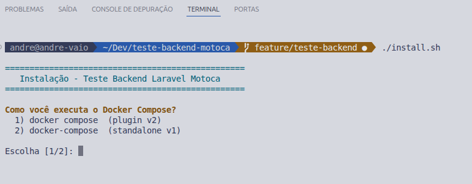
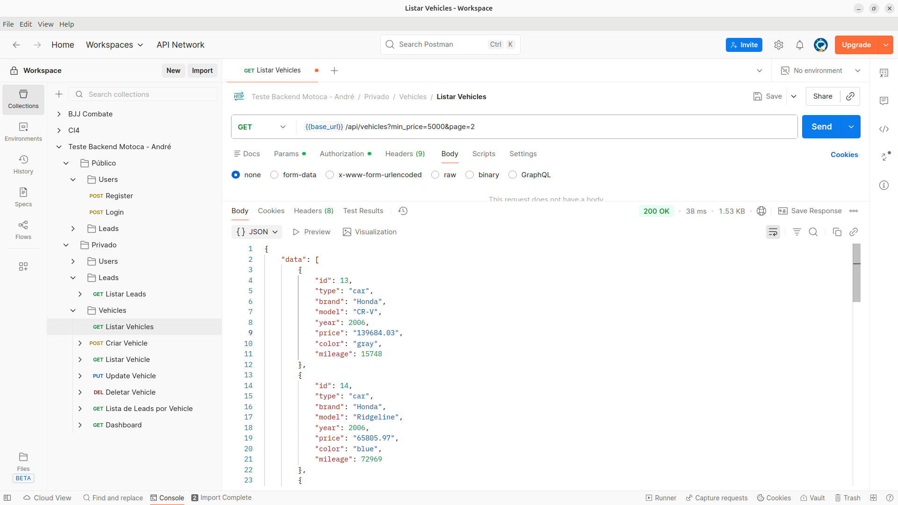
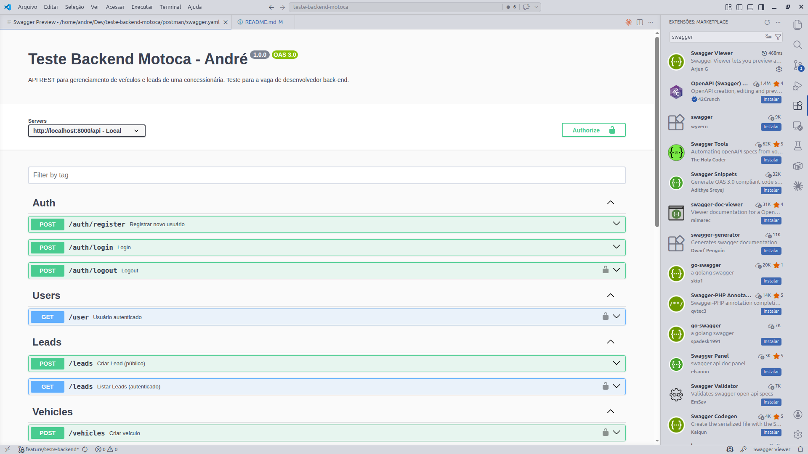

# Teste Técnico - Backend Laravel (Concessionária)

API REST para gerenciamento de veículos e leads de uma concessionária.

---

## Stack

- PHP 8.4
- Laravel 13
- PostgreSQL 16
- Docker / Docker Compose
- Nginx
- Laravel Sanctum (autenticação via token)

---

## Como rodar o projeto

> **Ambiente de desenvolvimento:** este projeto foi desenvolvido e testado em **Linux**. O script de instalação automática utiliza shell bash e comandos Unix nativos. Erros em ambiente Windows (fora do WSL2) não foram testados e podem ocorrer.

### Instalação automática (recomendado)

O projeto inclui um script `install.sh` que automatiza todo o processo de configuração com um menu interativo.

```bash
git clone git@github.com:andrepfdev/teste-backend-motoca.git
cd teste-backend-motoca
./install.sh
```

> O arquivo já possui permissão de execução commitada no repositório (`chmod +x`), não sendo necessário configurá-la manualmente.

O script irá:
1. Perguntar qual comando Docker você usa (`docker compose` ou `docker-compose`)
2. Criar o `.env` a partir do `.env.example`
3. Subir os containers
4. Aguardar o banco de dados ficar pronto
5. Gerar a `APP_KEY` se estiver vazia
6. Rodar as migrations
7. Perguntar se deseja popular o banco com seeders




---

### Instalação manual

#### 1. Clonar e configurar o ambiente

```bash
git clone git@github.com:andrepfdev/teste-backend-motoca.git
cd teste-backend-motoca
cp .env.example .env
```

#### 2. Subir os containers

```bash
docker compose up -d
```

A aplicação ficará disponível em `http://localhost:8000`.

#### 3. Rodar as migrations

```bash
docker compose exec app php artisan migrate
```

#### 4. Rodar os seeders (opcional)

```bash
docker compose exec app php artisan db:seed
```

O seeder cria os seguintes dados iniciais:

- **Usuário:** `test@example.com` / `password`
- **15 veículos** com dados fictícios
- **Leads** vinculados aleatoriamente aos veículos

### 4. Rodar os testes

```bash
docker compose exec app php artisan test --compact
```

**36 testes · 99 assertions · 0 falhas**

| Suite | Testes |
|-------|--------|
| `AuthTest` | Register, Login, Logout — happy path, credenciais inválidas, email duplicado, acesso sem token |
| `VehicleTest` | CRUD completo, filtros por tipo/preço, leads por veículo, acesso não autenticado |
| `LeadTest` | Criação pública, listagem protegida, validações, veículo inexistente |
| `DashboardTest` | Contagens corretas, veículo mais solicitado, banco vazio, acesso não autenticado |

Para rodar uma suite específica:

```bash
docker compose exec app php artisan test --compact tests/Feature/VehicleTest.php
```

---

## Coleção Postman

O arquivo com todos os endpoints configurados está em:

```
postman/Teste Backend Motoca - Andre.postman_collection.json
```

Importe no Postman via **File → Import**, as variáveis já deverão funcionar, caso não configure a variável `{{base_url}}` com `http://localhost:8000`. O token é preenchido automaticamente após Login ou Register.



---

## Autenticação

A API usa Laravel Sanctum com tokens Bearer. Todas as rotas marcadas como **autenticado** exigem o header:

```
Authorization: Bearer {token}
```

---

## Bônus Swagger

Na mesma pasta do postman deixei um extra:

```
postman/swagger.yaml
```

Para usar sugiro a extensão Swagger Viewer na própria IDE.



---

## Endpoints

### Autenticação

#### `POST /api/auth/register`

Cria um novo usuário e retorna o token de acesso.

**Público**

**Body:**
```json
{
  "name": "André",
  "email": "andre@example.com",
  "password": "password123",
  "password_confirmation": "password123"
}
```

**Resposta `201`:**
```json
{
  "data": {
    "user": { "id": 1, "name": "André", "email": "andre@example.com" },
    "token": "1|abc123..."
  }
}
```

---

#### `POST /api/auth/login`

Autentica o usuário e retorna o token de acesso.

**Público**

**Body:**
```json
{
  "email": "andre@example.com",
  "password": "password123"
}
```

**Resposta `200`:**
```json
{
  "data": {
    "user": { "id": 1, "name": "André", "email": "andre@example.com" },
    "token": "1|abc123..."
  }
}
```

**Resposta `401` (credenciais inválidas):**
```json
{
  "message": "Credenciais inválidas."
}
```

---

#### `POST /api/auth/logout`

Revoga o token atual.

**Autenticado**

**Resposta `200`:**
```json
{
  "message": "Logout realizado com sucesso."
}
```

---

### Veículos

Todos os endpoints de veículos são **autenticados**.

#### `GET /api/vehicles`

Lista todos os veículos com paginação (10 por página).

**Filtros disponíveis:**

| Parâmetro | Tipo | Descrição |
|-----------|------|-----------|
| `type` | `car` \| `motorcycle` | Filtra por tipo |
| `min_price` | number | Preço mínimo |
| `max_price` | number | Preço máximo |

**Exemplos:**
```
GET /api/vehicles?type=car
GET /api/vehicles?max_price=80000
GET /api/vehicles?type=motorcycle&min_price=5000&max_price=30000
```

**Resposta `200`:**
```json
{
  "data": [
    {
      "id": 1,
      "type": "car",
      "brand": "Honda",
      "model": "Civic",
      "year": 2022,
      "price": "85000.00",
      "color": "prata",
      "mileage": 15000
    }
  ],
  "links": { "first": "...", "last": "...", "prev": null, "next": null },
  "meta": { "current_page": 1, "per_page": 10, "total": 15, "last_page": 2 }
}
```

---

#### `POST /api/vehicles`

Cria um novo veículo.

**Autenticado**

**Body:**
```json
{
  "type": "car",
  "brand": "Honda",
  "model": "Civic",
  "year": 2022,
  "price": 85000.00,
  "color": "prata",
  "mileage": 15000
}
```

| Campo | Regras |
|-------|--------|
| `type` | obrigatório, `car` ou `motorcycle` |
| `brand` | obrigatório, string |
| `model` | obrigatório, string |
| `year` | obrigatório, inteiro, mínimo 1900 |
| `price` | obrigatório, numérico, mínimo 0 |
| `color` | obrigatório, string |
| `mileage` | obrigatório, inteiro, mínimo 0 |

**Resposta `201`:** objeto do veículo criado.

---

#### `GET /api/vehicles/{id}`

Retorna os dados de um veículo específico.

**Autenticado**

**Resposta `200`:**
```json
{
  "data": {
    "id": 1,
    "type": "car",
    "brand": "Honda",
    "model": "Civic",
    "year": 2022,
    "price": "85000.00",
    "color": "prata",
    "mileage": 15000
  }
}
```

---

#### `PUT /api/vehicles/{id}`

Atualiza os dados de um veículo. Todos os campos são opcionais.

**Autenticado**

**Body (parcial):**
```json
{
  "price": 79000.00,
  "mileage": 20000
}
```

**Resposta `200`:** objeto do veículo atualizado.

---

#### `DELETE /api/vehicles/{id}`

Remove um veículo.

**Autenticado**

**Resposta `200`:**
```json
{
  "message": "Vehicle deleted successfully"
}
```

---

#### `GET /api/vehicles/{id}/leads`

Lista todos os leads de um veículo específico, com paginação.

**Autenticado**

**Resposta `200`:** mesma estrutura paginada da listagem de leads.

---

### Leads

#### `POST /api/leads`

Registra interesse em um veículo.

**Público**

**Body:**
```json
{
  "name": "Maria Silva",
  "email": "maria@example.com",
  "phone": "(11) 99999-0000",
  "vehicle_id": 1,
  "message": "Tenho interesse neste veículo."
}
```

| Campo | Regras |
|-------|--------|
| `name` | obrigatório, string |
| `email` | obrigatório, email válido |
| `phone` | obrigatório, string |
| `vehicle_id` | obrigatório, deve existir na tabela `vehicles` |
| `message` | opcional, string |

**Resposta `201`:** objeto do lead criado.

---

#### `GET /api/leads`

Lista todos os leads com paginação (10 por página).

**Autenticado**

**Resposta `200`:**
```json
{
  "data": [
    {
      "id": 1,
      "name": "Maria Silva",
      "email": "maria@example.com",
      "phone": "(11) 99999-0000",
      "vehicle_id": 1,
      "message": "Tenho interesse neste veículo."
    }
  ],
  "links": { ... },
  "meta": { ... }
}
```

---

### Dashboard

#### `GET /api/dashboard`

Retorna um resumo geral da concessionária.

**Autenticado**

**Resposta `200`:**
```json
{
  "data": {
    "total_vehicles": 15,
    "total_leads": 32,
    "most_requested_vehicle": {
      "id": 3,
      "type": "car",
      "brand": "Toyota",
      "model": "Corolla",
      "year": 2021,
      "price": "95000.00",
      "color": "branco",
      "mileage": 8000
    }
  }
}
```

---

## Arquitetura

### Service Layer

A camada de serviço (`app/Services/`) foi introduzida intencionalmente como demonstração do padrão, mesmo que para a escala deste teste o uso direto do Eloquent nos controllers seria suficiente. A separação isola a lógica de negócio, facilita testes unitários e torna o código mais preparado para crescimento — mostrando familiaridade com design patterns aplicados ao Laravel.

### Form Requests

Toda validação de entrada usa classes `FormRequest` com mensagens em português, mantendo os controllers limpos.

### API Resources

Todas as respostas JSON são formatadas via Eloquent API Resources, garantindo consistência e desacoplamento entre o modelo e o contrato da API.

### Testes

Cobertura com PHPUnit Feature Tests usando `LazilyRefreshDatabase`. Cada suite testa happy path, falhas de validação e acesso não autorizado. As factories usam `recycle()` para evitar criação desnecessária de registros relacionados, mantendo os testes rápidos e isolados.
